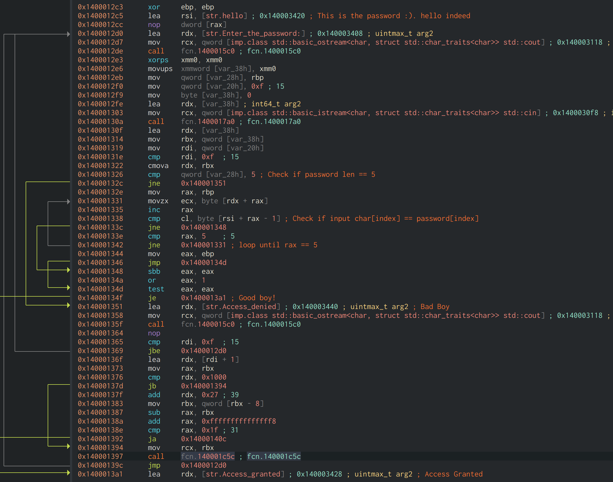
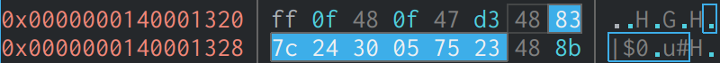
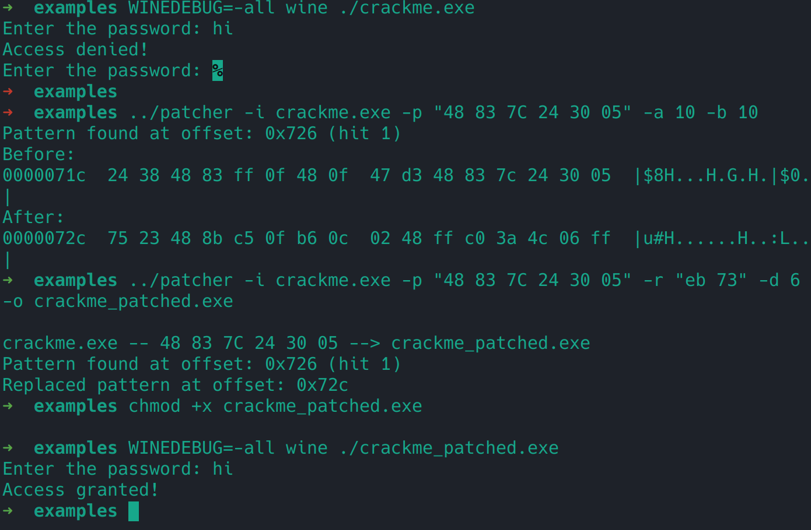

# Quick Binary Patching Tool

This little tool can scan for a byte pattern in a file, and show bytes before and after. It can also optionally patc the file using a pattern. The pattern doesnt need to be the same size as the search pattern. It also supports displacement, that is, if the unique bytes you want to patch is not a part of the search pattern due to addresses which might change at runtime, you can give it a positive or negative address as an optional argument.

build with `make` - check the Makefile for build options with `CC`
### Command line options

* -i: input file **mandatory**
* -p: pattern (ie: "83 7c 24 30 05 75 23 48") **mandatory**
* -r: replacement bytes (ie: "eb 0a" doesnt need to be same size as pattern)optional, only used if patching. It simply overwrites the bytes at offset+`-d` number with the bytes given.
* -o: output file to write to - optional, only used if patching.
* -b: print number of bytes before pattern (ie: -b 50) - optional.
* -a: print number of bytes after pattern (ie: -a 50) - optional.
* -d: displacement from pattern hit to patch (ie: -d -7) - optional.
* -h: hit to patch from if pattern hits multiple locations - optional.

### Example use

See example/ folder for a simple crackme from [crackmes.one](https://crackmes.one/crackme/681cc54a6297cca3ff7d7743)

We can easily tell the password is `hello` however, for the purpose of patching, we can also see we can simply break the out early by patching the first jump in the check password lenght. We click on that in [cutter.re](https://cutter.re) and check the bytes near that in the hex view:

Then we can simply check with the patch tool if we got the right location and force the jump to `access granted!`:

